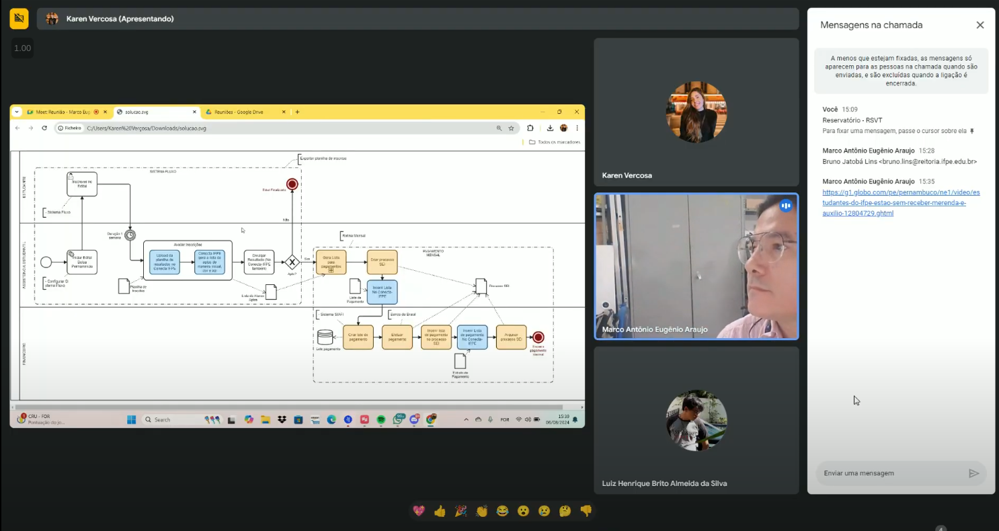

# Nome do Projeto

## Ata de Reunião

**Data**: 03/08/2024  
**Local**: Google Meet

### Participantes
- Marco Eugênio (Professor e Ex-diretor de TI do campus IFPE-Recife)
- Karen Vasconcelos (Desenvolvedora)
- Luiz Henrique (Desenvolvedor)

### Objetivos da Reunião
- Validar a remodelagem do processo de seleção de bolsas.
- Entender melhor o problema e tirar dúvidas.

### Tópicos Discutidos

Primeiro, abordamos que nem todo aluno apto necessariamente receberá a bolsa, já que a seleção é feita de maneira subjetiva. Alguns campi optam por diminuir o valor da bolsa para abranger mais alunos, ao invés de deixar de fora aqueles que estariam aptos.

Falamos também sobre a necessidade de realizar uma análise de dados mensalmente para verificar a frequência dos alunos bolsistas nas aulas. Se algum aluno não estiver comparecendo, as assistentes sociais poderão entrar em contato para entender se houve desistência ou se eles estão enfrentando problemas pessoais.

Outro ponto importante foi que, a cada vez que um aluno sai do programa, uma vaga é aberta para aqueles na lista de espera. Além disso, discutimos que os alunos que recebem a bolsa diretamente na boca do caixa têm um prazo de sete dias para retirar o dinheiro; caso contrário, o valor retorna à conta do IFPE.

Enfatizamos a função do SIAFI, que é um sistema que roda em mainframe e é utilizado para cadastrar os dados bancários dos beneficiários, além de se conectar ao Banco do Brasil para processar os pagamentos.

Um tópico crucial foi a organização dos dados dos alunos. O novo sistema deve ajudar a classificar os alunos em aptos, não aptos e em espera, utilizando planilhas e filtros automatizados. No entanto, ressaltamos que a decisão final sobre quem receberá a bolsa ainda ficará com a assistente social.

Por último, discutimos a importância de que o sistema também permita identificar e explicar eventuais problemas com os pagamentos dentro do Conecta UFPE. A ideia é ter um controle mais eficiente, utilizando a IA para treinar com dados das planilhas atuais, mas sempre com a decisão humana sendo prioridade.

### Decisões Tomadas
- **Decisão 1**: Adotar uma arquitetura de microserviços para garantir uma solução mais escalável e modular. Essa decisão permitirá que diferentes partes do sistema sejam desenvolvidas, implementadas e escaladas de forma independente, facilitando a manutenção e a integração de novas funcionalidades.

- **Decisão 2**: Ampliar o foco do sistema para incluir um canal de comunicação direta entre os atores (assistentes sociais, alunos e setor financeiro), permitindo a troca de notificações e arquivos. Essa decisão visa melhorar a interação e a colaboração entre os envolvidos, facilitando a coordenação das atividades e a atualização de informações em tempo real.

### Ações a Serem Tomadas
Ação         | Responsável   | Prazo
------------ | ------------- | -------------
Refinar os requisitos e funcionalidades do sistema | Luiz Henrique José Ronaldo | 18/08/2024
Criar protótipo de interface no Figma para validação | Karen e Vitória | 18/08/2024
Definir a arquitetura técnica do sistema | José Ronaldo | 18/08/2024

### Próxima Reunião
- **Data**: 18/08/2024
- **Local**: Google Meet
- **Agenda**: Validação da solução e protótipo de baixa fidelidade.

---

**Revisado por**: Karen Vasconcelos   
**Data da Revisão**: 08/08/2024

### Anexos

- [Gravação da Reunião](https://drive.google.com/file/d/1ZBpx2LsSApbhXLPB1Hdbkv-kNKrPduyh/view?usp=sharing)

 

- Modelo BPMN proposto

