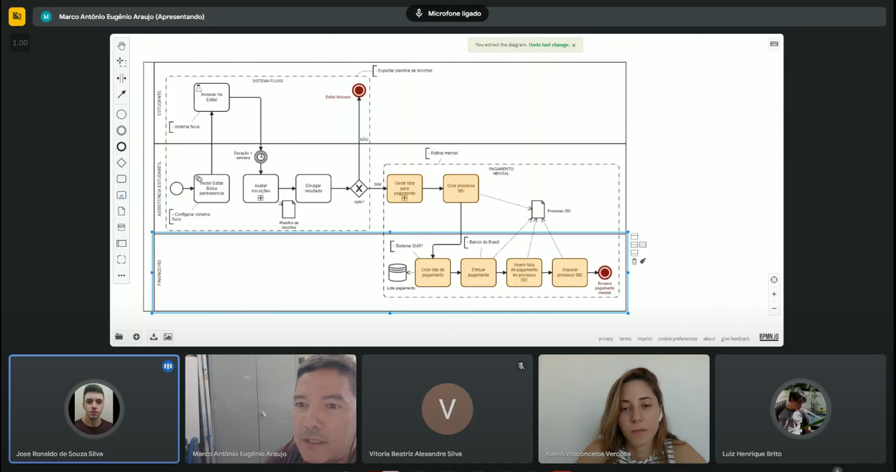

# Nome do Projeto

## Ata de Reunião

**Data**: 24/07/2024  
**Local**: Google Meet

### Participantes
- Marco Eugênio (Professor e Ex-diretor de TI do campus IFPE-Recife)
- José Ronaldo (Scrum Master)
- Karen Vasconcelos (Desenvolvedora)
- Luiz Henrique (Desenvolvedor)
- Vitória Beatriz (Desenvolvedora)

### Objetivos da Reunião
- Entender as necessidades do cliente.
- Entender as expectativas do cliente.
- Entender o processo interno de seleção de bolsas do IFPE-Recife.
- Entender o problema a ser resolvido.
- Discutir possíveis soluções para o problema e otimização do processo.

### Tópicos Discutidos

O Programa de Assistência Estudantil do IFPE destina um orçamento anual entre R$8 milhões e R$9 milhões para apoiar alunos em situação de vulnerabilidade econômica. A bolsa para alunos de nível técnico é de R$200, enquanto alunos de nível superior recebem um valor um pouco maior. O processo de seleção começa com a assistente social informando os períodos de inscrição específicos de cada campus, uma vez que cada um tem seu próprio calendário. O sistema utilizado para gerir o fluxo de inscrições e avaliações é chamado de "Fluxo", e nele os alunos acessam os períodos de inscrição liberados no sistema de acordo com o campus.

#### Inscrição e Avaliação
A inscrição no programa envolve o preenchimento de sete formulários com cerca de 40 perguntas, que coletam dados para avaliar a elegibilidade dos alunos. Após o término do período de inscrição, a assistente social exporta uma planilha contendo os dados dos inscritos, e a avaliação é feita seguindo uma fila de atendimento FIFO (o primeiro a se inscrever é o primeiro a ser avaliado). Essa etapa geralmente leva até duas semanas para ser concluída.

Cada campus tem autonomia para decidir como conduzir essa avaliação, já que fatores locais, como disponibilidade de transporte público, podem influenciar o processo de análise. Aproximadamente 60%-65% dos alunos inscritos são identificados como economicamente vulneráveis e, portanto, aptos a participar do programa. No entanto, se o número de alunos aptos exceder o número de bolsas disponíveis (por exemplo, 1500 alunos aptos para 1000 vagas), os 1000 alunos mais vulneráveis recebem a bolsa, enquanto os demais entram em uma lista de espera.

#### Fase de Pagamento
Após a seleção, os alunos aptos fornecem suas informações bancárias, como CPF e número da conta, que são extraídas dos formulários de inscrição. Em alguns campi, quando o número de alunos aptos excede o número de bolsas disponíveis, pode-se optar por reduzir o valor da bolsa para que todos os alunos sejam contemplados. Por exemplo, se há 1050 alunos aptos para 1000 bolsas, o valor individual da bolsa pode ser ajustado para R$190,40, em vez dos R$200 habituais, permitindo que todos recebam.

O sistema SEI (Sistema Eletrônico de Informações) é utilizado para organizar processos, mas não é um sistema de controle financeiro, apenas de gestão de processos. Quando a assistente social gera a lista de pagamento, essa lista é inserida no SEI em formato PDF. O setor financeiro, então, processa manualmente cada aluno no sistema SIAFI, que gera o lote de pagamento. Isso é feito aluno por aluno, o que torna o processo lento e suscetível a erros.

#### Problemas no Pagamento e Retornos
Mensalmente, o setor financeiro envia a lista de pagamento para o Banco do Brasil, que transfere o valor correspondente às contas dos alunos. No entanto, o processo frequentemente enfrenta problemas, como contas bancárias encerradas ou números de contas incorretos, obrigando alguns alunos a retirar o valor presencialmente em uma agência específica vinculada ao IFPE, a agência CEASA. Caso o aluno não retire o dinheiro em até 7 dias, o valor retorna à conta do IFPE e precisa ser novamente solicitado, o que pode gerar atrasos no recebimento.

Para cada pagamento que ocorre, o setor financeiro gera um extrato do Banco do Brasil e insere no processo SEI, encerrando o ciclo mensal. Contudo, o extrato pode não refletir todas as transferências corretamente, e o aluno só descobre que não recebeu o pagamento ao tentar sacar o dinheiro. Esse atraso na comunicação é problemático, pois exige a abertura de um novo processo para corrigir o erro e repassar o valor.

Se no mês seguinte algum aluno não estiver mais apto (por exemplo, por evasão ou falta de assiduidade), ele é removido da lista de pagamento, e um aluno da lista de espera pode ser incluído em seu lugar. Essa verificação de assiduidade é um critério fundamental para a continuidade do recebimento da bolsa. Caso o aluno cumpra todos os critérios, a lista de pagamento é renovada e o processo é repetido.

### Ações a Serem Tomadas
Ação         | Responsável   | Prazo
------------ | ------------- | -------------
Refinar os requisitos e funcionalidades do sistema | José Ronaldo | 06/08/2024
Proposta de solução | Equipe | 06/08/2024
Avaliar a viabilidade da IA com dados históricos dos últimos 10 anos dos editais | Luiz Henrique | Data de conclusão

### Próxima Reunião
- **Data**: 06/08/2024
- **Local**: Google Meet
- **Agenda**: Modelo BPMN do processo proposto e proposta de solução.

---

**Revisado por**: Vitória Beatriz   
**Data da Revisão**: 27/07/2024

### Anexos

- [Gravação da Reunião](https://drive.google.com/file/d/1lK9YiOg_CGXpvilvA1jlpHxv1euFkBx5/view?usp=sharing)

 

- Modelo BPMN do processo atual

