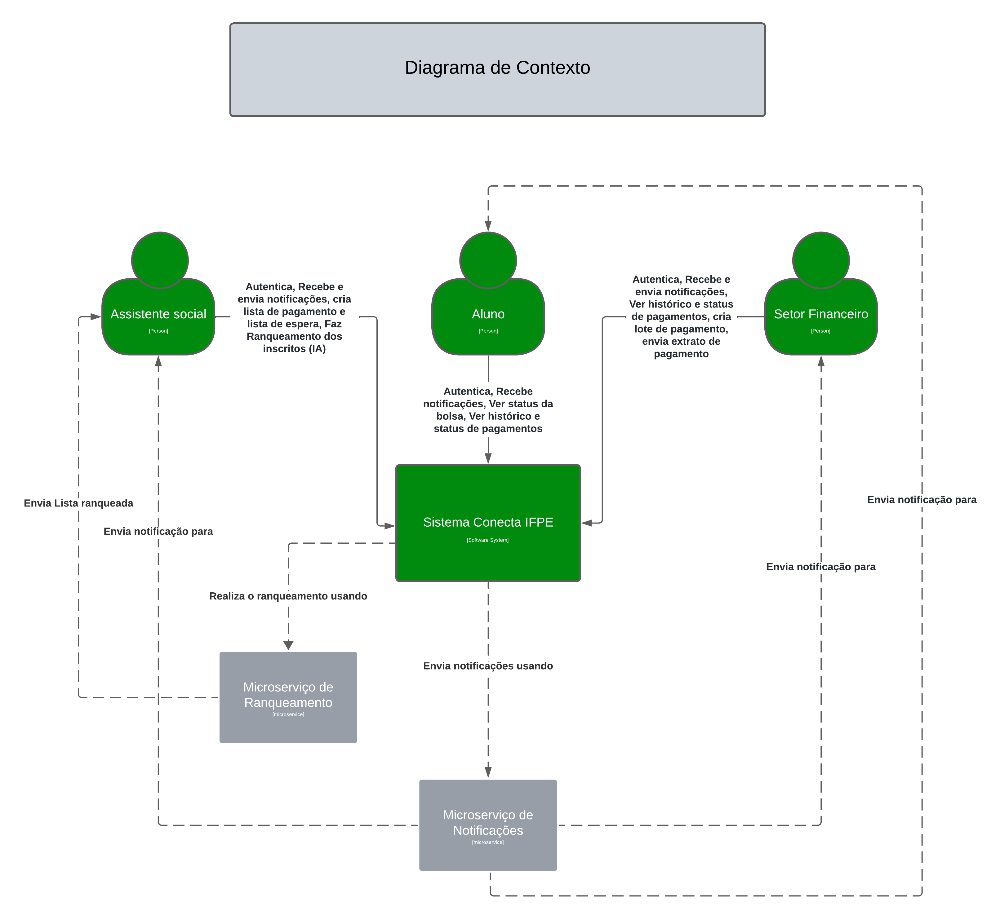
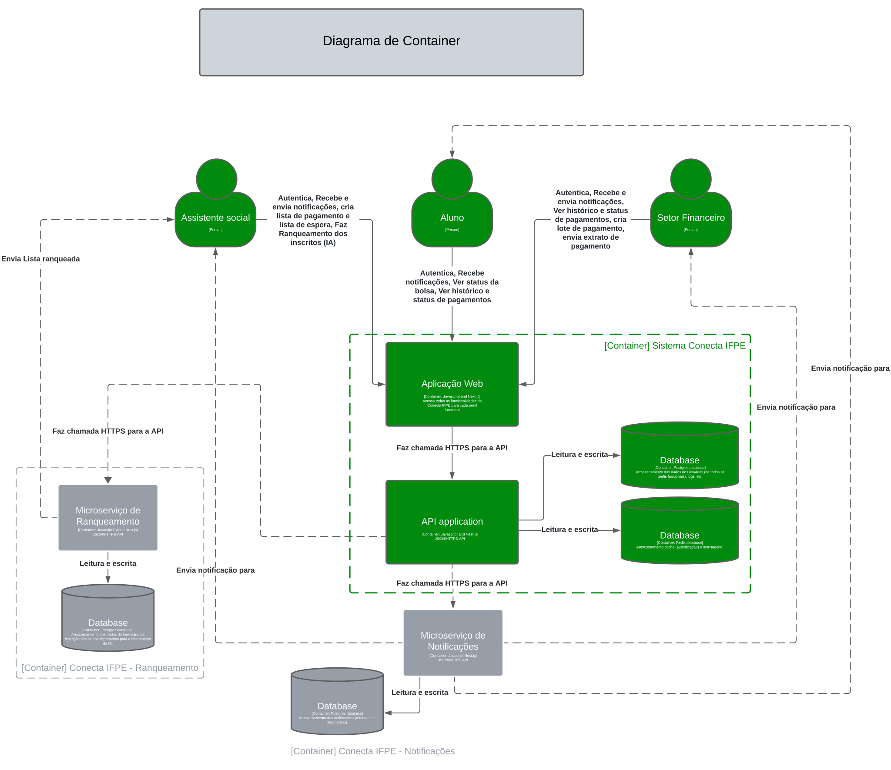
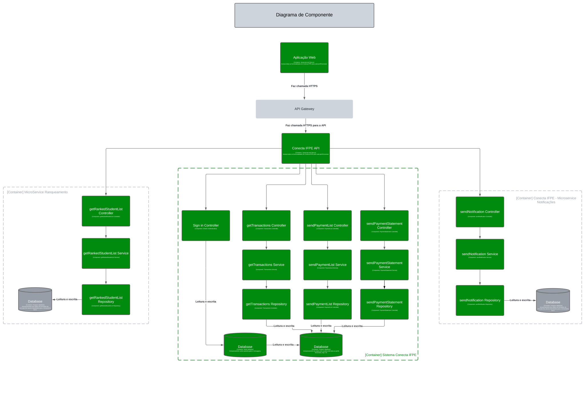

# Documentação da Arquitetura de Software

## Visão Geral
Este documento descreve a arquitetura de software do sistema ```Conecta IFPE``` utilizando o C4 Model. A arquitetura é apresentada em quatro níveis: Contexto, Contêiner, Componente e Código.

---
_**Instruções de Uso:**_

- _**Contexto**: Adicione uma visão geral de como o sistema interage com os usuários e sistemas externos._
- _**Contêiners**: Detalhe as principais partes do sistema, como a aplicação web, banco de dados, etc._
- _**Componentes**: Descreva a estrutura interna dos contêiners, detalhando os módulos e serviços principais._
- _**Código (Opcional)**: Use este nível para detalhar classes ou módulos críticos se necessário._
- _**Decisões Arquiteturais**: Documente as decisões tomadas e suas justificativas._
---

## 1. Diagrama de Contexto

### 1.1. Descrição do Diagrama de Contexto
O diagrama de contexto fornece uma visão geral de alto nível do sistema e suas interações com os atores externos.

- **Sistema:** Conecta IFPE
- **Atores Externos:** [Alunos, Assistente Social, Usuários do setor financeiro]

### 1.2. Diagrama


### 1.3. Descrição dos Componentes
- **Atores Externos:** Alunos: Estudantes que irão interagir com o sistema com o objetivo de acompanhar o andamento do pagamento da bolsa. Assistente social: Profissional de assistência social que irá interagir com o sistema para ranquear planilhas de alunos, e fazer a comunicação sobre o pagamento com o setor financeiro e com os alunos. Usuários do setor financeiro: Profissionais do setor financeiro que irão interagir com o sistema para relatar o andamento sobre o pagamento da bolsa.
- **Sistema:** Descrição do sistema e seu propósito principal.

---

## 2. Diagrama de Contêiner

### 2.1. Descrição do Diagrama de Contêiner
O diagrama de contêiner mostra os principais contêiners de software que compõem o sistema e como eles interagem entre si.

- **Contêiners Incluídos:** [Sistema Conecta IFPE, Conecta IFPE - Notificações, Conecta IFPE - Ranqueamento]

### 2.2. Diagrama


### 2.3. Descrição dos Contêiners

#### 2.3.1.
- **[Sistema Conecta IFPE]:** Descrição do contêiner, sua responsabilidade e tecnologias utilizadas.
  - **Tecnologias:** [Ex: Spring Boot, MySQL, etc.]
  - **Responsabilidade:** [Função principal do contêiner]
  - **Interações:** [IFPE - Notificações, Conecta IFPE - Ranqueamento]

---

#### 2.3.2.
- **[IFPE - Notificações]:** Contêiner responsável pelo gerenciamento de notificações entre alunos, assistente social e setor financeiro.
  - **Tecnologias:** [Ex: Spring Boot, MySQL, etc.]
  - **Responsabilidade:** [Função principal do contêiner]
  - **Interações:** [Sistema Conecta IFPE]

---

#### 2.3.3.
- **[Conecta IFPE - Ranqueamento]:** Contêiner do microsserviço de ranqueamento das listas de alunos. A assistência social vai enviar a planilha dos alunos inscritos (ordenada por ordem de inscrição), e receberá uma lista ordenada(ranqueada) pelo nível de necessidade de cada aluno, nível esse predido por uma inteligência artificial(IA) que foi treinada com planilhas antigas, a predição é feita a partir de algumas informações dos alunos que estão na planilha(ex: turno, renda bruta familiar, relato de vida, etc.). Existe uma IA só para a parte do texto dos relatos de vida, e outra para as informações restantes.
  - **Tecnologias:** [Python, Aprendizagem de máquina(Gradient Boost Machine e Spacy).]
  - **Responsabilidade:** [Ordenar a lista de alunos de acordo com o nível de necessidade de cada aluno.]
  - **Interações:** [Sistema Conecta IFPE]

---

## 3. Diagrama de Componente

### 3.1. Descrição do Diagrama de Componente
O diagrama de componente detalha a arquitetura interna de cada contêiner, mostrando os componentes que o compõem e suas interações.

### 3.2. Diagrama


#### 3.3.1 Descrição dos Componentes do [Sistema Conecta IFPE]
- **[Sign in Controller]:** Componente responsável por realizar o login na aplicação.
  - **Responsabilidade:** [Função principal do componente]
  - **Interações:** [Componentes com os quais interage]
  - **Tecnologias:** [Linguagens, frameworks, bibliotecas]

- **[getTransactions Controller]:** Descrição do componente, sua responsabilidade e interações.
  - **Responsabilidade:** [Função principal do componente]
  - **Interações:** [Componentes com os quais interage]
  - **Tecnologias:** [Linguagens, frameworks, bibliotecas]

- **[sendPaymentList Controller]:** Descrição do componente, sua responsabilidade e interações.
  - **Responsabilidade:** [Função principal do componente]
  - **Interações:** [Componentes com os quais interage]
  - **Tecnologias:** [Linguagens, frameworks, bibliotecas]

- **[sendPaymentStatement Controller]:** Descrição do componente, sua responsabilidade e interações.
  - **Responsabilidade:** [Função principal do componente]
  - **Interações:** [Componentes com os quais interage]
  - **Tecnologias:** [Linguagens, frameworks, bibliotecas]

- **[getTransactions Service]:** Descrição do componente, sua responsabilidade e interações.
  - **Responsabilidade:** [Função principal do componente]
  - **Interações:** [Componentes com os quais interage]
  - **Tecnologias:** [Linguagens, frameworks, bibliotecas]

- **[sendPaymentList Service]:** Descrição do componente, sua responsabilidade e interações.
  - **Responsabilidade:** [Função principal do componente]
  - **Interações:** [Componentes com os quais interage]
  - **Tecnologias:** [Linguagens, frameworks, bibliotecas]

- **[sendPaymentStatement Service]:** Descrição do componente, sua responsabilidade e interações.
  - **Responsabilidade:** [Função principal do componente]
  - **Interações:** [Componentes com os quais interage]
  - **Tecnologias:** [Linguagens, frameworks, bibliotecas]

- **[getTransactions Repository]:** Descrição do componente, sua responsabilidade e interações.
  - **Responsabilidade:** [Função principal do componente]
  - **Interações:** [Componentes com os quais interage]
  - **Tecnologias:** [Linguagens, frameworks, bibliotecas]

- **[sendPaymentList Repository]:** Descrição do componente, sua responsabilidade e interações.
  - **Responsabilidade:** [Função principal do componente]
  - **Interações:** [Componentes com os quais interage]
  - **Tecnologias:** [Linguagens, frameworks, bibliotecas]

- **[sendPaymentStatement Repository]:** Descrição do componente, sua responsabilidade e interações.
  - **Responsabilidade:** [Função principal do componente]
  - **Interações:** [Componentes com os quais interage]
  - **Tecnologias:** [Linguagens, frameworks, bibliotecas]

---

#### 3.3.2 Descrição dos Componentes do [IFPE - Notificações]
- **[getNotification Controller]:** Descrição do componente, sua responsabilidade e interações.
  - **Responsabilidade:** [Função principal do componente]
  - **Interações:** [Componentes com os quais interage]
  - **Tecnologias:** [Linguagens, frameworks, bibliotecas]

- **[getNotification Service]:** Descrição do componente, sua responsabilidade e interações.
  - **Responsabilidade:** [Função principal do componente]
  - **Interações:** [Componentes com os quais interage]
  - **Tecnologias:** [Linguagens, frameworks, bibliotecas]

- **[getNotification Repository]:** Descrição do componente, sua responsabilidade e interações.
  - **Responsabilidade:** [Função principal do componente]
  - **Interações:** [Componentes com os quais interage]
  - **Tecnologias:** [Linguagens, frameworks, bibliotecas]

---

#### 3.3.3 Descrição dos Componentes do [Conecta IFPE - Ranqueamento]
- **[getRankedStudentList Controller]:** Descrição do componente, sua responsabilidade e interações.
  - **Responsabilidade:** [Função principal do componente]
  - **Interações:** [Componentes com os quais interage]
  - **Tecnologias:** [Linguagens, frameworks, bibliotecas]

- **[getRankedStudentList Service]:** Descrição do componente, sua responsabilidade e interações.
  - **Responsabilidade:** [Função principal do componente]
  - **Interações:** [Componentes com os quais interage]
  - **Tecnologias:** [Linguagens, frameworks, bibliotecas]

- **[getRankedStudentList Repository]:** Descrição do componente, sua responsabilidade e interações.
  - **Responsabilidade:** [Função principal do componente]
  - **Interações:** [Componentes com os quais interage]
  - **Tecnologias:** [Linguagens, frameworks, bibliotecas]

---

## 4. Diagrama de Código (Opcional) (EM BREVE)

### 4.1. Descrição do Diagrama de Código
Este nível detalha o design e a arquitetura do código dentro de um componente específico. Ideal para sistemas complexos ou quando há necessidade de documentar padrões de design específicos.

### 4.2. Diagrama


### 4.3. Descrição do Código
- **[Nome da Classe/Módulo]:** Descrição da estrutura de código, padrões de design utilizados e principais responsabilidades.
  - **Métodos:** [Descrição dos principais métodos e sua funcionalidade]
  - **Padrões de Design:** [Padrões de design aplicados, como Singleton, Factory, etc.]

---

## 5. Decisões Arquiteturais

### 5.1. Decisões Importantes
Documente aqui as decisões arquiteturais importantes que foram tomadas durante o desenvolvimento do projeto, incluindo justificativas e impactos.

- **Decisão:** [Uso da arquiteture de microsserviços e MVC]
  - **Descrição:** [Detalhes sobre a decisão]
  - **Justificativa:** [Motivo pelo qual a decisão foi tomada]
  - **Impacto:** [Impacto da decisão no sistema]

---

## 6. Considerações Finais

### 6.1. Padrões e Práticas
Liste os padrões arquiteturais e práticas recomendadas que foram seguidos durante o desenvolvimento da arquitetura.

- **Padrões:** [Ex: MVC, CQRS, Event-Driven Architecture]
- **Práticas:** [Ex: Continuous Integration, Code Review, etc.]

### 6.2. Próximos Passos
Indique quaisquer melhorias futuras ou áreas a serem exploradas para a evolução da arquitetura.

---

**Autores:** [Luiz Henrique Brito Almeida da Silva, José Ronaldo de Souza Silva, Vitória Beatriz Alexandre Silva, Karen Vasconcelo Verçosa, Cauê Marinho]  
**Data:** [09/09/2024]